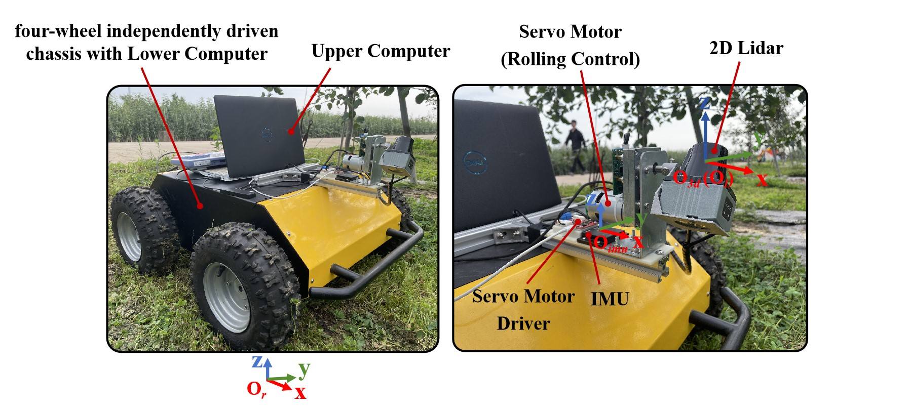

## Development_of_an_Autonomous_Navigation_System_Based_on_Rolling_2D_Lidar_in_Modern_Apple_Orchards (The Project is in Process)
We have developed an autonomous mobile robot for modern orchards. This robot is capable of scanning the orchard environment using a 2D lidar through rolling motion to obtain 3D point cloud data of the orchard. It then utilizes the 3D point cloud of the current tree row to extract and fit tree row lines and the navigation line. By employing trajectory tracking, the robot achieves motion control, enabling autonomous navigation between rows. At the end of each row, it utilizes point cloud data to determine and locate the end of the row, and ultimately performs the U-turn. The robot is mainly composed of a 2D lidar, a servo motor (equipped with high-precision magnetic encoders), an IMU (Inertial Measurement Unit), and a four-wheel independently driven chassis (with wheel speed feedback). The robot and all sensors follow the right-hand Cartesian coordinate system

  

### Construction of 3D Point Clouds
Synchronizing the 2D point cloud, servo motor angle feedback, wheeled odometry, and IMU data, and registering the 2D point cloud data into the O3d-xyz reference coordinate system for 3D point clouds, ultimately publishing the accumulated 3D point cloud data from every half rolling cycle at a frequency of 15 Hz for environmental perception processing. The result of indoor 3D point cloud acquisition is as follows.

